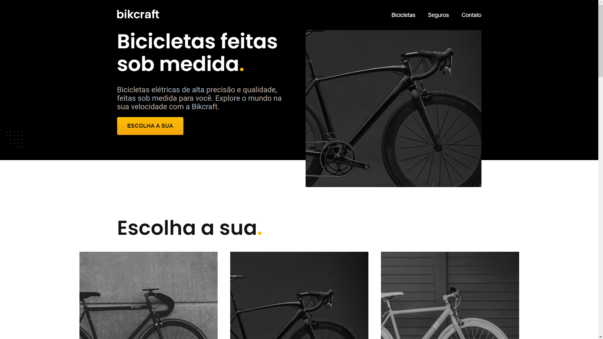

# BIKCRAFT

## Tabela de conteúdos

- [Visão Geral](#visão-geral)
    - [Objetivo](#objetivo)
    - [Funcionalidades](#funcionalidades)
  - [Captura de Tela](#captura-de-tela)
  - [Links](#links)
- [O meu processo](#o-meu-processo)
  - [Construído com](#construído-com)
  - [O que aprendi](#o-que-aprendi)
- [Execução do Projeto](#execução-do-projeto)
- [Autor](#autor)

## Visão geral

### Objetivo

Projeto desenvolvido durante o curso de [HTML e CSS para Iniciantes](https://www.origamid.com/curso/html-e-css-para-iniciantes/) da plataforma de ensino [Origamid](https://www.origamid.com) com o intuito de colocar em prática os conceitos e boas práticas de desenvolvimento utilizando HTML semântico e CSS.

---

### Funcionalidades

- [x] Responsivo
- [x] Animação de botões
- [x] Animação de elementos
- [x] Animação de Cards

<br>

### Captura de Tela



<br>

### Links

- URL da solução: [Repositório Github](https://github.com/laylsonalencar/projeto-bike-laylson)
- Link do projeto online: [Github Pages](https://github.com/laylsonalencar/projeto-bike-laylson)

<br>

## O meu processo

#### Construído com:

- HTML 5
- CSS 3
- CSS Flex-box
- CSS Grid-Layout
- JavaScript

### O que aprendi

Durante este projeto eu pude aprender os conceitos e boas práticas no desenvolvimento de uma aplicação web real, utilizando as ferramentas básicas na 
construção de um site.

<br>

## Execução do Projeto

### Pré-requisitos

Antes de começar, você vai precisar ter instalado em sua máquina as seguintes ferramentas:
[Git](https://git-scm.com), [Node.js](https://nodejs.org/en/) e [Live Server](https://marketplace.visualstudio.com/items?itemName=ritwickdey.LiveServer). 
Além disto é bom ter um editor para trabalhar com o código como [VSCode](https://code.visualstudio.com/)

### 🎲 Rodando em localhost

```bash
# Clone este repositório
$ git clone <https://github.com/laylsonalencar/projeto-bike-laylson>

# Acesse a pasta do projeto no terminal/cmd
$ cd projeto-bikcraft

# Execute a aplicação em um servidor HTTP Live Server
# No arquivo 'index.html' execute o comando:
$ alt+L alt+O

# O servidor inciará na porta:3000 - acesse <http://localhost:3000>
```

<br>

## Autor

<a href="https://github.com/laylsonalencar">
 
 <br />
 <sub><b>Gustavo Dantas</b></sub></a> <a href="https://github.com/laylsonalencar" title="GitHub">🚀</a>


Feito com ❤️ por laylson lopes alencar👋🏽

 [](https://www.linkedin.com/in/laylson-lopes-alencar-016916150/) 


